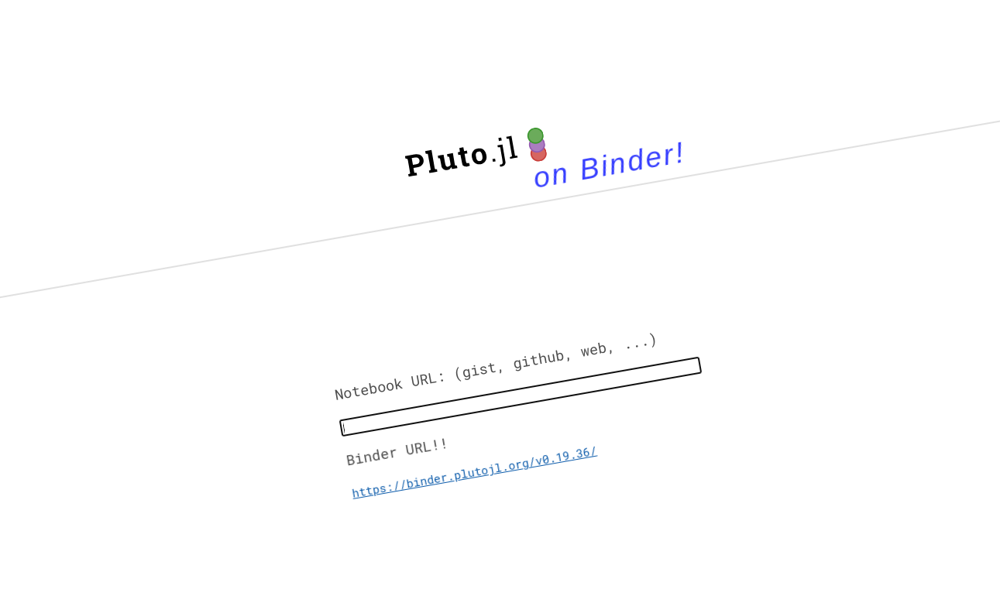
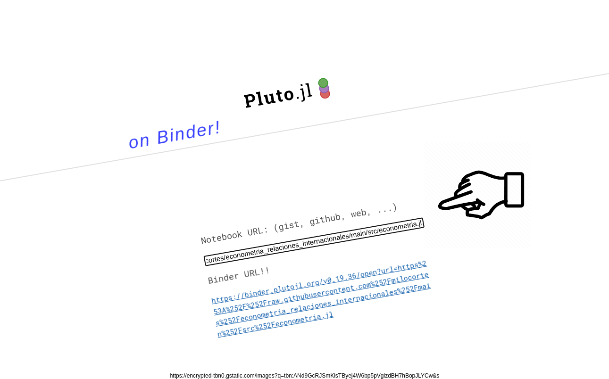
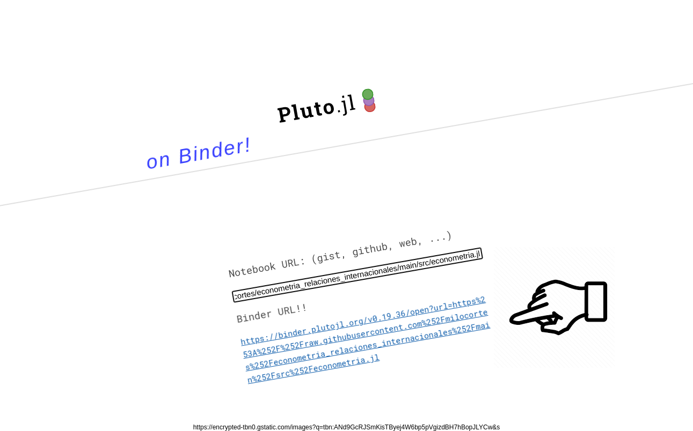

# Introducción a la Estadística

Curso de Introducción a la Estadística para estudiantes de nuevo ingreso de la Maestría en Política Pública (MPP) de la Escuela de Gobierno 


## Ejecución del Notebook de Pluto

Ve a la siguiente dirección:

https://pluto-on-binder.glitch.me/





Copia y pega la siguiente dirección en el sitio anterior:

```
https://raw.githubusercontent.com/milocortes/econometria_relaciones_internacionales/main/src/econometria.jl
```



Abre la ruta que se genera en el sitio de binder


